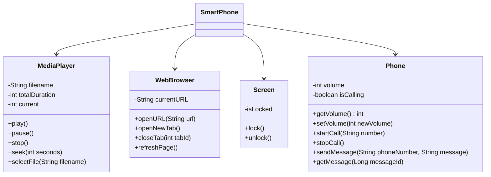

# DIO - Java UML

Modelagem e diagramação UML de algumas funcionalidades comuns em smartphones como reprodução de mídia, fazer ligações e navegar na internet.

```mermaid
classDiagram
  SmartPhone --> MediaPlayer
  SmartPhone --> WebBrowser
  SmartPhone --> Screen
  SmartPhone --> Phone
  class SmartPhone {

  }
  class MediaPlayer {
    -String filename
    -int totalDuration
    -int current
    +play()
    +pause()
    +stop()
    +seek(int seconds)
    +selectFile(String filename)
  }
  class WebBrowser {
    -String currentURL
    +openURL(String url)
    +openNewTab()
    +closeTab(int tabId)
    +refreshPage()
  }
  class Screen {
    -isLocked
    +lock()
    +unlock()
  }
  class Phone {
    -int volume
    -boolean isCalling
    +getVolume() int
    +setVolume(int newVolume)
    +startCall(String number)
    +stopCall()
    +sendMessage(String phoneNumber, String message)
    +getMessage(Long messageId)
  }
```
